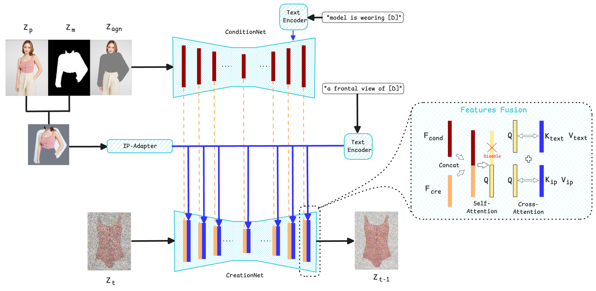

# DualDiff-VTOFF 👗⚡

### What Matters in Virtual Try-Off? Dual-UNet Diffusion Model For Garment Reconstruction

**Accepted at ICPR 2026**

> *Loc-Phat Truong, Meysam Madadi, Sergio Escalera*
> 
> HuPBA Group, Universitat de Barcelona & Computer Vision Center

---

## Overview

**Virtual Try-Off (VTOFF)** is the inverse problem of Virtual Try-On: given an on-body image, reconstruct the canonical garment as it would appear flat or unworn — realistic enough to belong on a product catalogue page.

Beyond its aesthetic appeal, VTOFF has practical implications for the fashion industry, potentially supporting brands in reducing the cost and effort of flat-lay photoshoots through automated garment reconstruction.

---

## Architecture

*Overview of the Dual-UNet Diffusion Model framework for VTOFF.*

The framework consists of two branches:

- **CreationNet** (Generation branch) — a denoising UNet that generates the garment image
- **ConditionNet** (Conditioning branch) — extracts low-level features from a VTON-styled input, formed by channel-concatenating the VAE-encoded latents of the person, mask, and cloth-agnostic image

High-level features are provided by an **IP-Adapter** and a **text encoder** (garment description). These high-level and low-level features are fused via self-attention and cross-attention to condition CreationNet.

---

## Abstract

Virtual Try-On (VTON) has seen rapid advancements, providing a strong foundation for generative fashion tasks. However, the inverse problem, Virtual Try-Off (VTOFF) — aimed at reconstructing the canonical garment from an on-body image — is emerging as a critical, yet less understood, complement for streamlined person-to-person VTON and improved human-garment feature representation.

In this work, we bridge the architectural design gap by studying the most successful diffusion-based strategies from VTON and general Latent Diffusion Models (LDMs) in the VTOFF domain. We focus our investigation on the strong **Dual-UNet Diffusion Model** architecture and analyze three axes of design:

- **(i) Generation Backbone** — comparing Stable Diffusion variants
- **(ii) Conditioning** — ablating different mask designs, masked/unmasked inputs for image conditioning, and the utility of high-level semantic features
- **(iii) Losses and Training Strategies** — evaluating the impact of auxiliary attention-based loss, perceptual objectives, and multi-stage curriculum schedules

Extensive experiments reveal trade-offs across various configuration options. Evaluated on **VITON-HD** and **DressCode** datasets, our framework achieves state-of-the-art performance with a **9.5% drop on the primary metric DISTS** and competitive performance on LPIPS, FID, KID, and SSIM.

---

## 🚧 Code & Models — Coming Soon

We are currently preparing the codebase for public release. This will include:

- [ ] Inference code
- [ ] Pretrained model weights

**Stay tuned** — watch or star this repo to be notified when released! ⭐

---

## Citation

If you find this work useful, please consider citing: (Coming soon)

---

## License

This project is licensed under the **Apache License 2.0** — see the [LICENSE](LICENSE) file for details.

---

  <a href="https://www.ub.edu">Universitat de Barcelona</a> •
  <a href="https://www.cvc.uab.es">Computer Vision Center</a> •
  HuPBA Group

